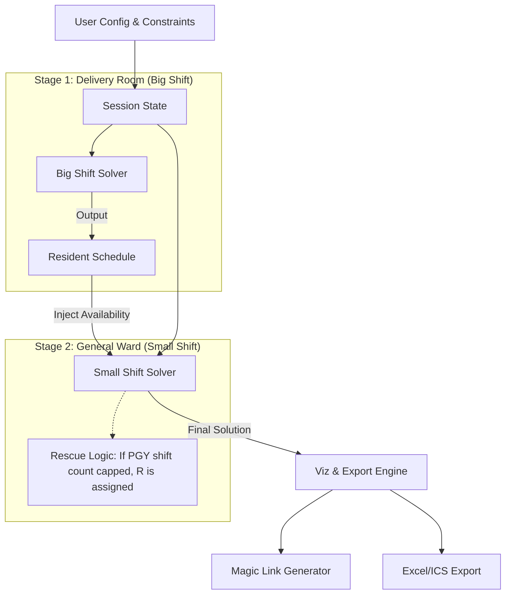

# Cardinal Tien Hospital Dual-Track Rostering System

[English Documentation](#english-documentation) | [中文說明與使用手冊](#chinese-documentation)

---

## English Documentation

### 🏗 System Architecture & Design

This system utilizes **Constraint Programming (CP)** to solve the complex medical rostering problem. We model the schedule as a global optimization task using **Google OR-Tools (CP-SAT)**.

#### 1. Data Flow & Solver Pipeline
The system operates on a **Dependency Injection** model. The schedule is solved in two sequential stages:

#### 2. Mathematical Model

The solver maximizes an objective function $J$ based on a strict hierarchy of penalties:

$$
\text{Maximize } J = \sum (W_{fair} \cdot \text{Balance}) - \sum (W_{penalty} \cdot \text{Violations}) + \sum (W_{wish} \cdot \text{Preferences})
$$

#### 3. Decision Matrix (Priority Hierarchy)

| Priority | Rule Name | Weight (Penalty) | Design Intent |
| :--- | :--- | :--- | :--- |
| **Critical** | **Hard Constraints** | $\infty$ | Coverage, Consecutive shifts, Absolute leaves. |
| **High** | **PGY Shift Limit** | `1,000,000` | PGYs strictly limited to 6 weekday / 2 weekend shifts. |
| **High** | **R Rescue Cost** | `50,000` | **Key Logic:** Since $50k < 1M$, the solver forces R to rescue rather than breaking PGY limits. |
| **Medium** | **No-Go Pref** | `5,000` | Strong preference against specific dates. |
| **Low** | **Fairness** | `500` | Minimize variance in total shifts. |
| **Lowest** | **Point Target** | `100` | Soft target (Points > 10). Acceptable if necessary. |

---

## 中文說明與使用手冊

這是一套專為 **耕莘醫院婦產科** 量身打造的智慧排班系統。

### 📖 使用者操作手冊 (User Guide)

#### 第一步：基礎設定
1.  **日期設定**：在左側欄位選擇年份與月份。
2.  **國定假日**：若本月有紅字（如中秋節、國慶日），請在左側 **「🏮 國定假日」** 下拉選單中勾選。
    *   *注意：被勾選的日子會被視為「假日班 (2點)」，且計入假日限額。*

#### 第二步：輸入名單
1.  點擊中間的 **「1. 人員與限制設定」**。
2.  切換分頁輸入 **🔴 大班 (VS/R)** 與 **🔵 小班 (PGY/Int)** 的姓名。
    *   *提示：名字之間用逗號隔開即可，例如：`張醫師, 王醫師`。*

#### 第三步：設定請假 (最重要！)
這是排班成敗的關鍵。請展開 **「⛔️ 請假/未到職設定 (絕對排除)」** 紅色區塊。
*   **這是什麼？** 婚假、喪假、出國、未到職日。
*   **系統行為**：系統 **絕對不會** 在這些日子排班。
*   *警告：若太多人同時請同一天假，導致當天無人可值，系統最後會報錯並顯示「無解」。*

#### 第四步：設定意願 (許願池)
展開下方的 **「排班意願」** 區塊。
*   **VS 指定值班**：優先權最高，一定會排進去。
*   **不想值班 (No-Go)**：單純那天想休息、有聚餐。系統會**盡全力避開**，但如果人力真的不足（例如 PGY 滿了且 R 也要支援），系統可能會犧牲這個意願（會在報告中顯示）。

#### 第五步：開始運算與決策
1.  設定 **「產生方案數量」** (建議 3~5 組)。
2.  點擊 **「🚀 開始排班」**。
3.  **如何選擇最佳班表？**
    *   看 **統計表**：確認大家的班數是否平均。
    *   看 **犧牲報告 (Sacrifice Report)**：
        *   若看到 `[小班] 洋洋 (R3) 支援小班`：代表當天 PGY/Intern 班數已滿 (6平/2假)，必須由 R3 下來支援。
        *   若看到 `點數超標`：代表該醫師比較累，請總醫師評估是否接受。

#### 第六步：分發班表
系統提供兩種分發方式：
1.  **Excel 公告**：點擊 **「📥 下載 Excel 日曆格式」**，列印出來貼在公佈欄。
2.  **魔術連結 (Magic Link)**：
    *   滑到最下方的 **「🔗 分發連結」**。
    *   展開 **「點擊展開所有醫師連結」**。
    *   複製特定醫師的網址傳給他 (Line/Email)。
    *   *優點：醫師點開只能看到自己的班表，且可直接加入手機行事曆。*
### ❓ 常見問題 (FAQ)

**Q1: 為什麼系統顯示「無法找出可行解」？**
> **A:** 通常是因為 **「絕對請假」** 設定太多，導致某一天所有人都不在。請試著減少紅色區塊的勾選，改用「不想值班」來設定。

**Q2: 為什麼住院醫師 (R) 會被排到小班？**
> **A:** 這是 v4.8 的核心功能。當所有 PGY 和 Intern 的班數都達到上限 (平日6/假日2) 時，為了不讓他們違規，系統會強制 R 下來填補空缺。

**Q3: 如何備份我輸入好的名單與假單？**
> **A:** 設定好後，點擊左側邊欄的 **「💾 下載設定 (JSON)」**。下次開啟網頁時，直接上傳這個檔案，所有資料就會回來了。

---

### 🏗 系統設計文件 (Design Doc)

*(此區塊供工程維護人員參考)*

#### 1. 演算法架構 (Architecture)
系統採用 **雙軌序列求解 (Sequential Solving)** 架構。Phase 1 運算大班，Phase 2 運算小班並注入 Phase 1 的 R 值班表作為限制，以判斷 R 是否有空支援。

#### 2. 權重決策矩陣 (Decision Matrix)
| 優先級 | 規則名稱 | 權重 (扣分) | 演算法決策邏輯 |
| :--- | :--- | :--- | :--- |
| **1 (最高)** | **絕對法規** | **無限大** | 每日覆蓋、連續值班、絕對請假。 |
| **2** | **PGY 班數天條** | **1,000,000** | PGY/Int 嚴格禁止超過平日6班/假日2班。 |
| **3** | **R 救援代價** | **50,000** | 若 PGY 滿班，強制 R 支援 (代價遠小於讓 PGY 超班)。 |
| **4** | **不想值班** | **5,000** | 保護生活品質。 |
| **5** | **公平性** | **500** | 最小化班數變異。 |

### 📜 授權 (License)
MIT License
